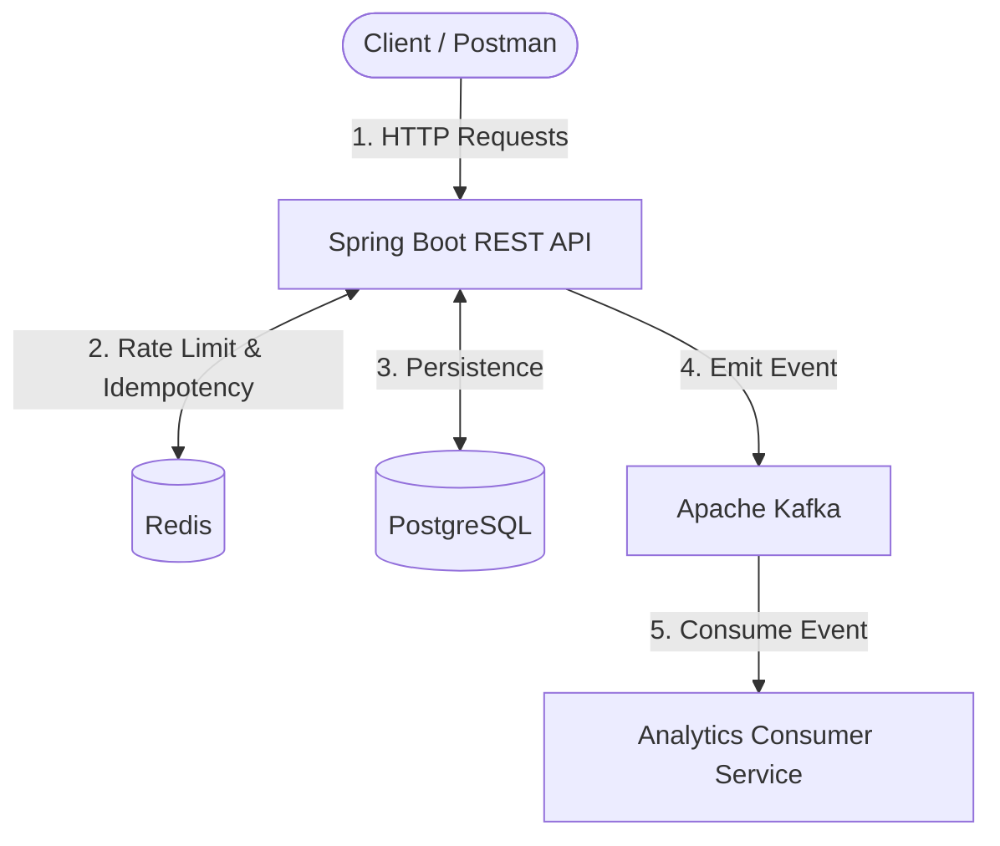

# Treso: Distributed Expense Tracking API

Treso is a secure, production-ready REST API for personal expense tracking, built with Java and Spring Boot. 

Originally a standard CRUD application, Treso has been architected into a distributed, event-driven system designed to handle concurrent workloads, prevent data loss, and scale asynchronous processing.

## 🏗️ System Architecture



## 🚀 Engineering Highlights

- **Event-Driven Architecture:** Utilizes **Apache Kafka** (KRaft mode) to decouple the synchronous CRUD operations from heavy downstream processing (like analytics and notifications).
- **API Idempotency:** Implements a distributed lock using **Redis** to intercept `Idempotency-Key` headers. This prevents duplicate financial records in the event of client retries or network timeouts.
- **Rate Limiting:** Protects endpoints from abuse/spam by enforcing a strict requests-per-minute quota on a per-user basis using Redis.
- **Data Durability:** Orchestrated via **Kubernetes**, deploying PostgreSQL as a `StatefulSet` with PersistentVolumeClaims to guarantee zero data loss during pod restarts.
- **Secure Authentication:** User registration and route protection using stateless **JWT (JSON Web Tokens)**.

## 🛠️ Tech Stack

- **Core:** Java 21, Spring Boot 3 (Spring Web, Spring Data JPA, Spring Security)
- **Database:** PostgreSQL
- **Distributed State / Cache:** Redis
- **Message Broker:** Apache Kafka (KRaft)
- **Containerization & Orchestration:** Docker, Docker Compose, Kubernetes
- **API Documentation:** OpenAPI (Swagger UI)

---

## 💻 Getting Started

### 1. Clone the Repository
```bash
git clone https://github.com/YOUR_USERNAME/treso.git
cd treso
```

### 2. Run Locally (Docker Compose)
The easiest way to spin up the entire distributed system locally is via Docker Compose, which will boot PostgreSQL, Redis, Kafka, and the Spring Boot application.
```bash
# Build the application image
docker build -t treso-app:local .

# Spin up the cluster
docker-compose up -d
```

### 3. Run on Kubernetes (Minikube / Docker Desktop)
Treso includes a complete suite of production-ready Kubernetes manifests in the `k8s/` directory.

```bash
# 1. Apply the secrets
cp k8s/postgres-secret.yaml.example k8s/postgres-secret.yaml
kubectl apply -f k8s/postgres-secret.yaml

# 2. Deploy Stateful Infrastructure (DB, Cache, Broker)
kubectl apply -f k8s/postgres.yaml
kubectl apply -f k8s/redis.yaml
kubectl apply -f k8s/kafka.yaml

# 3. Deploy the Spring Boot API
kubectl apply -f k8s/treso.yaml
```

*Note: The application is exposed via a LoadBalancer on port 8080. If your LoadBalancer is pending locally, access it by running: `kubectl port-forward svc/treso-app-service 8080:8080`*

---

## 🧾 API Endpoints & Testing

- **Swagger UI:** `http://localhost:8080/swagger-ui.html`
- **Auth:** `POST /api/auth/register`, `POST /api/auth/login`
- **Expenses:** `GET /api/expenses`, `POST /api/expenses`, `PUT /api/expenses/{id}`, `DELETE /api/expenses/{id}`

### Testing Idempotency
To test the Redis idempotency lock, add an `Idempotency-Key` header (e.g., `Idempotency-Key: test-123`) to a `POST /api/expenses` request. If you fire the exact same request twice within 5 minutes, the API will safely reject the second request with a `409 Conflict`.

### Testing Rate Limiting
Authenticated users are limited to 20 requests per minute. Exceeding this threshold by spamming an endpoint will result in a `429 Too Many Requests` response.

---

> Built with Spring Boot, Java 21, and ❤️ by Harshal Patel
